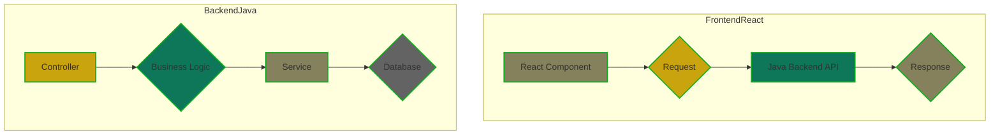

# Project Full Stack Dscommerce

### Frontend - React TypeScript Vite

### Backend - Java Spring

```mermaid
graph TD
  subgraph FrontendReact
    A[React Component] --> B{Request}
    B --> C[Java Backend API]
    C --> D{Response}
    style A fill:#84815c,stroke:#0caf1d,stroke-width:2px
    style B fill:#c9a40f,stroke:#0caf1d,stroke-width:2px
    style C fill:#0f7759,stroke:#0caf1d,stroke-width:2px
    style D fill:#84815c,stroke:#0caf1d,stroke-width:2px
  end

  subgraph BackendJava
    E[Controller] --> F{Business Logic}
    F --> G[Service]
    G --> H{Database}
    style E fill:#c9a40f,stroke:#0caf1d,stroke-width:2px
    style F fill:#0f7759,stroke:#0caf1d,stroke-width:2px
    style G fill:#84815c,stroke:#0caf1d,stroke-width:2px
    style H fill:#636363,stroke:#0caf1d,stroke-width:2px
  end

```