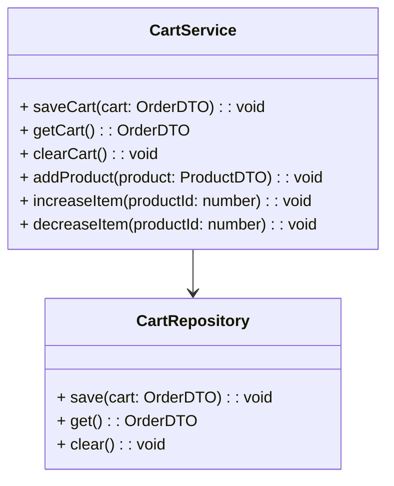
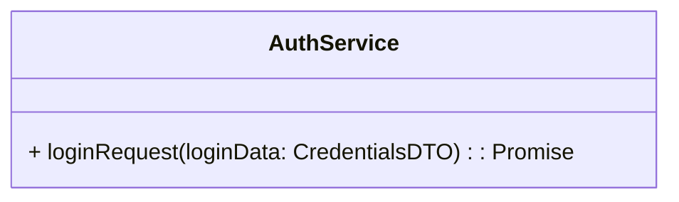
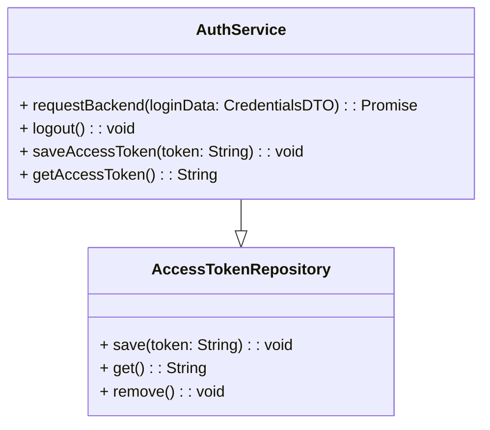

# React + TypeScript + Vite

### Create project
```bash
yarn create vite <project-name> --template react-ts
```
### Run project
```bash
yarn dev --host
```
### Install react router dom
```bash
yarn add react-router-dom@6.4.1 @types/react-router-dom@5.3.3
``` 
[FIGMA](https://www.figma.com/file/ZrGNVNG0kZL6txDv4G8P6s/DSCommerce?type=design&node-id=5-130&mode=design&t=g2WkpiFEtJhXMhai-0)

### Install Axios
```bash
yarn add axios@0.27.2
```

### Class diagram Cart


### QS

```bash
yarn add qs@6.11.0 @types/qs@6.9.7
```


### Diagram global token in localStorage

